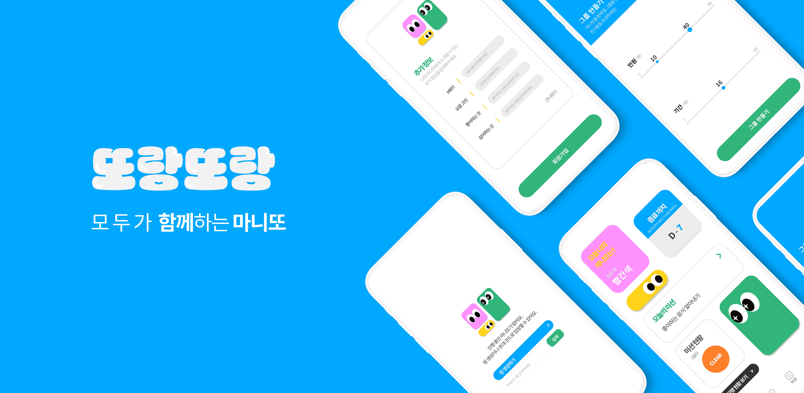
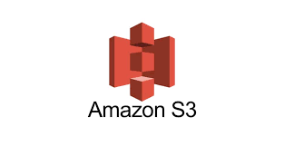

## 🤍 목차 🤍

[**서비스 소개**](#1)
[**프로젝트 일정**](#2)
[**팀원 소개**](#3)
[**기술 스택**](#4)
[**시스템 구성도**](#5)
[**주요 기능**](#6)

## ❤️ 서비스 소개 ❤️

### 또랑또랑 🤩

##### 친목 도모를 위한 대규모 마니또 앱 서비스

마니또 게임을 통해 풍부한 인적 네트워크를 형성할 수 있는 게임 서비스

 

### 🎉 구글 플레이 스토어 배포 🎉

2022년 11월 14일 배포 완료!
[🍀 보러가기 🍀](https://play.google.com/store/apps/details?id=com.ssafy.ddorangddorang)

 

## 🧡 프로젝트 기간 🧡

### 23.10.10 ~ 23.11.17

기획 및 디자인 : 23.10.10 ~ 23.10.19
프로젝트 개발 : 23.10.20 ~ 23.11.17

 

## 💛 팀원 소개 💛

<table>
    <tr>
        <td height="140px" align="center"> <a href="https://github.com/hy06ixk">
                👑 이효식  (Back-End) </a>  </td>
        <td height="140px" align="center"> <a href="https://github.com/138901146">
                🙂 박우현  (Back-End) </a>  </td>
        <td height="140px" align="center"> <a href="https://github.com/greenTea31">
                😆 백승일  (Back-End / CI / CD) </a>  </td>
        <td height="140px" align="center"> <a href="https://github.com/ryunayeon">
                😁 류나연  (PM) </a>  </td>
        <td height="140px" align="center"> <a href="https://github.com/yeonjulee812">
                🙄 이연주  (Front-End) </a>  </td>
        <td height="140px" align="center"> <a href="https://github.com/HongJaeyeon">
                😶 홍재연  (Front-End) </a>  </td>
    </tr>
</table>

 

## 💚 기술 스택 💚

### Frontend

|                 TypeScript                 |             React-Native              |                Node.js                 |                 recoil                 |
| :----------------------------------------: | :-----------------------------------: | :------------------------------------: | :------------------------------------: |
|  |  |  |  |

### Backend

|                 Java                 |                 SpringBoot                 |                 SpringSecurity                 |                Spring Data JPA                |                AWS RDS                 |                AWS S3                 |                 Redis                 |                 Nginx                 |                 Docker                 |                 Jenkins                 |
| :----------------------------------: | :----------------------------------------: | :--------------------------------------------: | :-------------------------------------------: | :------------------------------------: | :-----------------------------------: | :-----------------------------------: | :-----------------------------------: | :------------------------------------: | :-------------------------------------: |
|  |  |  |  |  |  |  |  |  |  |

 
 

## 💙 시스템 구성도 💙

- ### 시스템 아키텍처

    

 

- ### ERD
    

 

## 💜 주요 기능 💜

### 게임 생성 및 참여

인원, 기간을 설정하여 게임 시작

대기 목록을 통한 참가자 승인

초대 코드를 통한 게임 참여
 

### 마니또 및 마니또와의 채팅 기능

실시간 채팅 기능

 

### 마니띠 도와주기 미션 수행

매일 아침 9시 새로운 미션 할당

2번의 랜덤 변경 기회

 

### 마니또 추측 및 결과 확인

게임 종료 3일 전부터 나의 마니또 추측

참가자의 모든 결과 확인

